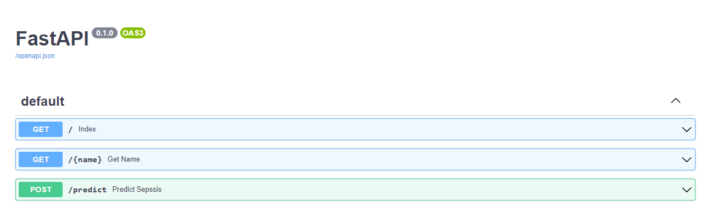
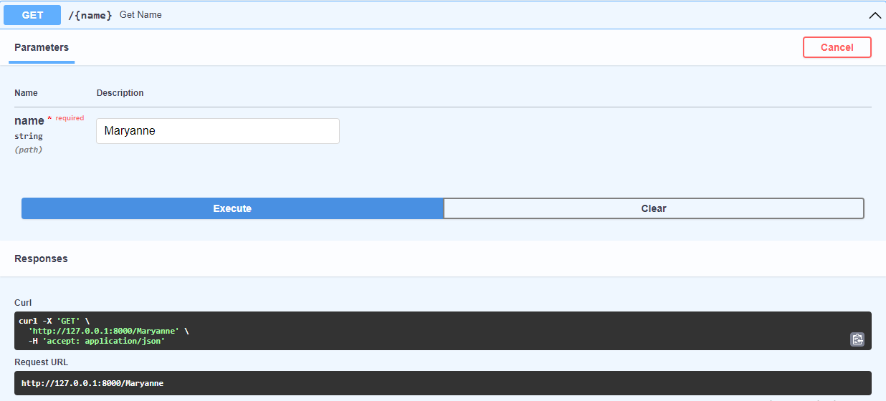
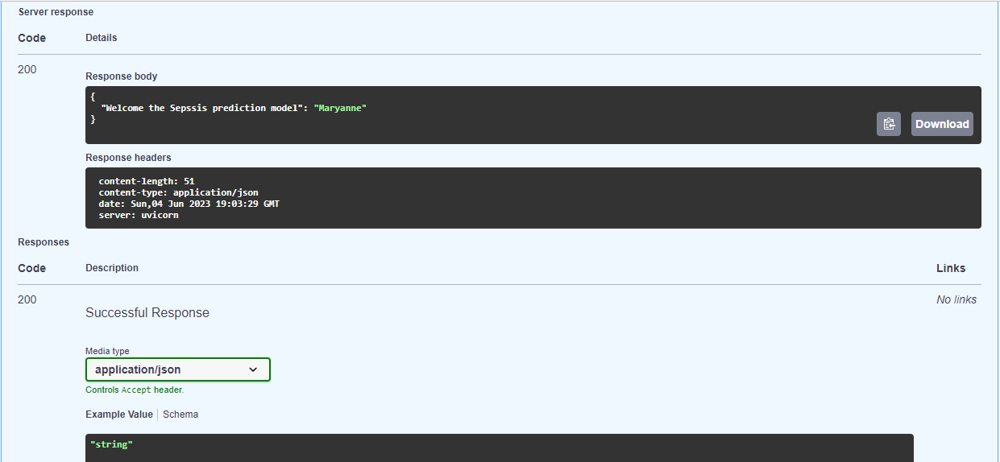
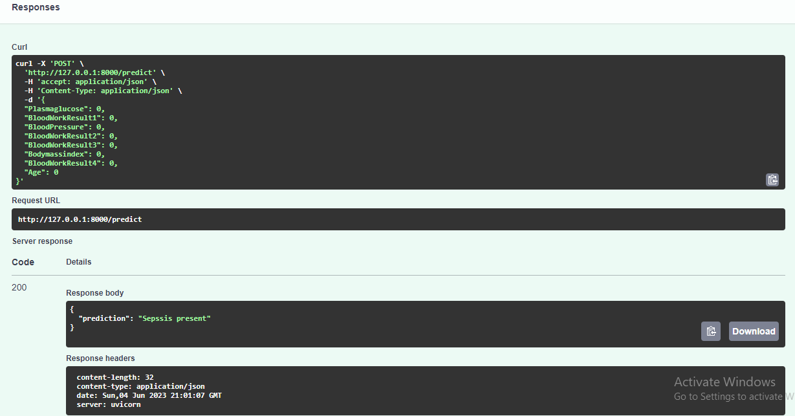

<!-- Improved compatibility of back to top link: See: https://github.com/othneildrew/Best-README-Template/pull/73 -->
<a name="readme-top"></a>
<!--
*** Thanks for checking out the Best-README-Template. If you have a suggestion
*** that would make this better, please fork the repo and create a pull request
*** or simply open an issue with the tag "enhancement".
*** Don't forget to give the project a star!
*** Thanks again! Now go create something AMAZING! :D
-->


<!-- PROJECT SHIELDS -->
<!--
*** I'm using markdown "reference style" links for readability.
*** Reference links are enclosed in brackets [ ] instead of parentheses ( ).
*** See the bottom of this document for the declaration of the reference variables
*** for contributors-url, forks-url, etc. This is an optional, concise syntax you may use.
*** https://www.markdownguide.org/basic-syntax/#reference-style-links
-->
[![Contributors][contributors-shield]][contributors-url]
[![Forks][forks-shield]][forks-url]
[![Stargazers][stars-shield]][stars-url]
[![Issues][issues-shield]][issues-url]
[![MIT License][license-shield]][license-url]
[![LinkedIn][linkedin-shield]][linkedin-url]


<!-- PROJECT LOGO -->
<br />
<div align="center">
  <a href="https://i.morioh.com/2022/08/13/e9f19675.webp">
    
  </a>

<h3 align="center">Machine Learning_API using FastAPI</h3>
 Project Description
  <p align="center">
   
 <br />
   In this project, we aim to create an API that can be requested to interact with a ML model. This is an interesting solution when you want to keep your model architecture secret or to make your model available to users already having an API. By creating an API, and deploying it, your model can so that receive request using the internet protocol as presented by the illustration below.

Sepsis is an infection of the blood stream resulting in a cluster of symptoms such as drop in a blood pressure, increase in heart rate and fever.

The model that we will build will be able to determine the prescence or abscence of Sepsis.

    
  </p>
</div>


<!-- TABLE OF CONTENTS -->
<details>
  <summary>Table of Contents</summary>
  <ol>
    <li>
      <a href="#about-the-project">About The Project</a>
      <ul>
        <li><a href="#built-with">Built With</a></li>
      </ul>
    </li>
    <li>
      <a href="#getting-started">Getting Started</a>
      <ul>
        <li><a href="#prerequisites">Prerequisites</a></li>
        <li><a href="#installation">Installation</a></li>
      </ul>
    </li>
    <li><a href="#usage">Usage</a></li>
    <li><a href="#roadmap">Roadmap</a></li>
    <li><a href="#contributing">Contributing</a></li>
    <li><a href="#license">License</a></li>
    <li><a href="#contact">Contact</a></li>
    <li><a href="#acknowledgments">Acknowledgments</a></li>
  </ol>
</details>


<!-- ABOUT THE PROJECT -->
## About The Project

[![Interface Screenshot][interface-screenshot]](assets/snip1.PNG) 

This project focuses on developing a regression model to predict the likelihood of a patient having sepsis. Sepsis, a potentially life-threatening condition caused by the body's response to an infection, requires prompt identification and treatment for better patient outcomes.

To accomplish this, we built a robust regression model using advanced machine learning techniques and a comprehensive dataset comprising various clinical features. The model was trained on historical patient data, enabling it to learn patterns and make accurate predictions regarding the presence of sepsis.

Additionally, we developed a powerful API using FastAPI, a modern web framework for building efficient and scalable web applications. The API allows seamless integration of our sepsis prediction model into any software system or application, providing real-time predictions based on patient data. 

<p align="right">(<a href="#readme-top">back to top</a>)</p>


### Built With

* [![Numpy][Numpy.py]][Numpy-url]
* [![Pandas][Pandas.np]][Pandas-url]
* [![Sklearn][Sklearn]][Sklearn-url]
* [![FastAPI][FastAPI]][FastAPI-url]


<p align="right">(<a href="#readme-top">back to top</a>)</p>


<!-- GETTING STARTED -->
## Getting Started


To get a local copy up and running follow these simple example steps.

### Prerequisites

This is an example of how to list things you need to use the software and how to install them.
* Set up virtual environment
  ```sh
  python -m venv myenv
  ```

### Installation

1. Activate virtual environment
   ```sh
   myenv\Scripts\activate
   ```
2. Navigate to directory with requirements file.
   ```sh
   cd /path/to/project
   ```
3. Install requirements.txt
   ```sh
   pip install -r requirements.txt
  

<p align="right">(<a href="#readme-top">back to top</a>)</p>


<!-- USAGE EXAMPLES -->
## Usage

By providing this predictive model and API, we aim to support healthcare professionals in early identification and proactive management of sepsis, ultimately improving patient outcomes and reducing the associated risks.



First screenshot of the interface.


Second screenshot of the interface.


Third screenshot of the interface.


Fourth screenshot of the interface.


<p align="right">(<a href="#readme-top">back to top</a>)</p>


<!-- ROADMAP -->
## Roadmap

- Regression model trained on diverse patient data to predict sepsis presence.
- Utilization of advanced machine learning techniques for accurate predictions.
- FastAPI integration for creating a robust and scalable API.
- Real-time predictions based on patient data input.


<p align="right">(<a href="#readme-top">back to top</a>)</p>


<!-- CONTRIBUTING -->
## Contributing

Contributions are what make the open source community such an amazing place to learn, inspire, and create. Any contributions you make are **greatly appreciated**.

If you have a suggestion that would make this better, please fork the repo and create a pull request. You can also simply open an issue with the tag "enhancement".
Don't forget to give the project a star! Thanks again!

1. Fork the Project
2. Create your Feature Branch (`git checkout -b feature/AmazingFeature`)
3. Commit your Changes (`git commit -m 'Add some AmazingFeature'`)
4. Push to the Branch (`git push origin feature/AmazingFeature`)
5. Open a Pull Request

<p align="right">(<a href="#readme-top">back to top</a>)</p>


<!-- LICENSE -->
## License


<p align="right">(<a href="#readme-top">back to top</a>)</p>


<!-- CONTACT -->
## Contact

Your Name - [@twitter_handle](https://twitter.com/muchaimaryanne) 

Project Link: [Github] (https://github.com/muchaimaryanne/Machine-Learning-API-using-FastAPI)
Article Link: [Medium] ([https://github.com/muchaimaryanne/Machine-Learning-API-using-FastAPI](https://medium.com/@muchaimaryanne/predicting-sepsis-risk-with-decision-tree-regression-building-an-interactive-api-with-fastapi-cb6a80807fd4))


<p align="right">(<a href="#readme-top">back to top</a>)</p>


<!-- ACKNOWLEDGMENTS -->
## Acknowledgments


I would like to express my gratitude to my team for their valuable contributions to this project:


* [Queensly Kyerewaa ](https://github.com/teammate3):
* [Edwin Mungai](https://github.com/teammate3):
* [Florentia Teye](https://github.com/teammate3):
* [Tikue Zeleke](https://github.com/teammate3):

I would also like to thank the entire team for their collaboration, support, and commitment to this project. It has been an enriching experience working with all of you, and I am proud of what we have accomplished together.

<p align="right">(<a href="#readme-top">back to top</a>)</p>


<!-- MARKDOWN LINKS & IMAGES -->
<!-- https://www.markdownguide.org/basic-syntax/#reference-style-links -->
[contributors-shield]: https://img.shields.io/github/contributors/github_username/repo_name.svg?style=for-the-badge
[contributors-url]: https://github.com/github_username/repo_name/graphs/contributors
[forks-shield]: https://img.shields.io/github/forks/github_username/repo_name.svg?style=for-the-badge
[forks-url]: https://github.com/github_username/repo_name/network/members
[stars-shield]: https://img.shields.io/github/stars/github_username/repo_name.svg?style=for-the-badge
[stars-url]: https://github.com/github_username/repo_name/stargazers
[issues-shield]: https://img.shields.io/github/issues/github_username/repo_name.svg?style=for-the-badge
[issues-url]: https://github.com/github_username/repo_name/issues
[license-shield]: https://img.shields.io/github/license/github_username/repo_name.svg?style=for-the-badge
[license-url]: https://github.com/github_username/repo_name/blob/master/LICENSE.txt
[linkedin-shield]: https://img.shields.io/badge/-LinkedIn-black.svg?style=for-the-badge&logo=linkedin&colorB=555
[linkedin-url]: https://linkedin.com/in/muchaimaryanne
[interface-screenshot]: assets/snip1.PNG 
[Next.js]: https://img.shields.io/badge/next.js-000000?style=for-the-badge&logo=nextdotjs&logoColor=white
[Next-url]: https://nextjs.org/
[Numpy.py]: https://img.shields.io/badge/numpy-numpy-blue
[Numpy-url]: https://numpy.org/
[Pandas.np]: https://img.shields.io/badge/Pandas-Pandas-brightgreen
[Pandas-url]: https://pandas.pydata.org/
[Sklearn]: https://img.shields.io/badge/Sklearn-Sklearn-red
[SKlearn-url]: https://scikit-learn.org/
[FastAPI]: https://img.shields.io/badge/FastAPI-FastAPI-lightgrey
[FastAPI-url]: https://fastapi.tiangolo.com/lo/
